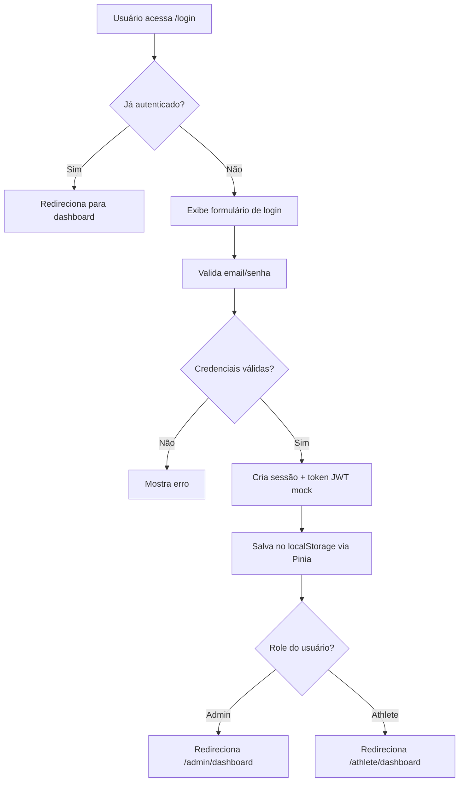

# 🏑 Hockey Club Management - Guia de Desenvolvimento

## 📋 Índice

- [Instalação](#instalação)
- [Executando o Projeto](#executando-o-projeto)
- [Estrutura do Projeto](#estrutura-do-projeto)
- [Arquitetura](#arquitetura)
- [Design System](#design-system)
- [Autenticação](#autenticação)
- [Próximos Passos](#próximos-passos)

---

## 🚀 Instalação

### Pré-requisitos

```bash
# Node.js >= 18.0.0
node --version

# pnpm >= 8.0.0
pnpm --version

# Se não tiver pnpm instalado:
npm install -g pnpm
```

### Instalar Dependências

```bash
# Na raiz do projeto
cd /tmp/hockey-club-management

# Instalar todas as dependências do monorepo
pnpm install
```

---

## 🏃 Executando o Projeto

### Modo Desenvolvimento

```bash
# Rodar todos os serviços em paralelo (frontend + backend)
pnpm dev

# OU rodar individualmente:

# Frontend apenas (http://localhost:3000)
pnpm dev:web

# Backend apenas (http://localhost:4000)
pnpm dev:api
```

### Acessar a Aplicação

- **Frontend**: http://localhost:3000
- **Backend API**: http://localhost:4000/api
- **Swagger Docs**: http://localhost:4000/api/docs

### Contas de Teste (Fase 1)

#### Admin
- **Email**: `admin@hockeyclub.com`
- **Senha**: Qualquer senha com 6+ caracteres
- **Acesso**: Dashboard completo de administração

#### Atleta
- **Email**: `athlete@hockeyclub.com`
- **Senha**: Qualquer senha com 6+ caracteres
- **Acesso**: Dashboard limitado do atleta

---

## 📁 Estrutura do Projeto

```
hockey-club-management/
│
├── apps/
│   ├── web/                      # Frontend Vue 3
│   │   ├── src/
│   │   │   ├── assets/
│   │   │   │   └── styles/
│   │   │   │       └── main.css  # Design tokens CSS
│   │   │   ├── components/       # Componentes reutilizáveis
│   │   │   │   └── ui/          # shadcn-vue components (instalar sob demanda)
│   │   │   ├── composables/     # Vue composables (hooks)
│   │   │   │   ├── useAuth.ts
│   │   │   │   └── useLoading.ts
│   │   │   ├── layouts/         # Layouts por role
│   │   │   │   ├── AdminLayout.vue
│   │   │   │   └── AthleteLayout.vue
│   │   │   ├── lib/             # Utilities
│   │   │   │   ├── design-tokens.ts  # Design system tokens
│   │   │   │   └── utils.ts          # Helper functions
│   │   │   ├── pages/           # Page components
│   │   │   │   ├── auth/
│   │   │   │   │   └── LoginPage.vue
│   │   │   │   ├── admin/
│   │   │   │   │   └── DashboardPage.vue
│   │   │   │   ├── athlete/
│   │   │   │   │   └── DashboardPage.vue
│   │   │   │   └── NotFoundPage.vue
│   │   │   ├── router/          # Vue Router config
│   │   │   │   └── index.ts     # Routes + guards
│   │   │   ├── stores/          # Pinia stores
│   │   │   │   ├── auth.store.ts
│   │   │   │   ├── loading.store.ts
│   │   │   │   └── index.ts
│   │   │   ├── App.vue          # Root component
│   │   │   └── main.ts          # Entry point
│   │   ├── index.html
│   │   ├── vite.config.ts
│   │   ├── tailwind.config.js
│   │   ├── components.json      # shadcn-vue config
│   │   └── package.json
│   │
│   └── api/                      # Backend NestJS
│       ├── src/
│       │   ├── app.controller.ts
│       │   ├── app.service.ts
│       │   ├── app.module.ts
│       │   └── main.ts          # Entry point
│       ├── nest-cli.json
│       ├── tsconfig.json
│       └── package.json
│
├── packages/
│   └── types/                    # Tipos compartilhados
│       ├── src/
│       │   ├── user.types.ts
│       │   ├── event.types.ts
│       │   ├── attendance.types.ts
│       │   ├── debt.types.ts
│       │   ├── financial.types.ts
│       │   ├── api.types.ts
│       │   └── index.ts
│       ├── tsconfig.json
│       └── package.json
│
├── pnpm-workspace.yaml
├── package.json
└── README.md
```

---

## 🏗️ Arquitetura

### Clean Architecture

O projeto segue **Clean Architecture** com camadas bem definidas:

```
┌─────────────────────────────────────────┐
│         Presentation Layer              │
│   (Vue Components, Pages, Layouts)      │
├─────────────────────────────────────────┤
│       Application Layer                 │
│  (Stores, Composables, Router Guards)   │
├─────────────────────────────────────────┤
│         Domain Layer                    │
│    (Types, Business Rules, Entities)    │
├─────────────────────────────────────────┤
│      Infrastructure Layer               │
│   (API Clients, Supabase, Services)     │
└─────────────────────────────────────────┘
```

### Princípios Aplicados

#### 1. **Separation of Concerns**
- Cada camada tem responsabilidade única
- UI não contém lógica de negócio
- Stores gerenciam estado, Composables expõem interface limpa

#### 2. **Dependency Inversion**
- Componentes dependem de abstrações (composables)
- Não acoplam diretamente a stores ou serviços

#### 3. **Single Responsibility**
- Cada arquivo/módulo tem um propósito claro
- Stores por feature, não por tipo de dado

#### 4. **DRY (Don't Repeat Yourself)**
- Design tokens centralizados
- Composables reutilizáveis
- Tipos compartilhados entre frontend/backend

---

## 🎨 Design System

### Paleta de Cores

Baseada em **Laranja, Preto e Branco**:

```typescript
// apps/web/src/lib/design-tokens.ts

colors: {
  primary: 'hsl(24, 100%, 50%)',    // Laranja vibrante
  secondary: 'hsl(0, 0%, 10%)',     // Preto
  background: 'hsl(0, 0%, 100%)',   // Branco
  // ... mais cores
}
```

### Uso Correto

❌ **ERRADO** (hardcoded):
```vue
<div style="color: #ff6600; padding: 16px">
```

✅ **CORRETO** (usando tokens):
```vue
<script setup>
import { designTokens } from '@/lib/design-tokens'
</script>

<div :style="{ 
  color: designTokens.colors.primary.DEFAULT,
  padding: designTokens.spacing.md 
}">
```

Ou com Tailwind classes:
```vue
<div class="text-brand bg-background p-md">
```

### Design Tokens Disponíveis

- **Colors**: primary, secondary, background, text, border, status
- **Spacing**: xs (4px), sm (8px), md (16px), lg (24px), xl (32px), 2xl, 3xl
- **Typography**: fontSize, fontWeight, lineHeight
- **Border Radius**: sm, md, lg, xl, full
- **Shadows**: sm, md, lg, xl
- **Z-index**: dropdown, sticky, modal, popover, tooltip

---

## 🔐 Autenticação

### Fluxo Implementado (Fase 1)



### Proteção de Rotas

Implementada via **Vue Router Guards**:

```typescript
// apps/web/src/router/index.ts

router.beforeEach((to, from, next) => {
  const authStore = useAuthStore()
  
  // 1. Verifica autenticação
  if (requiresAuth && !authStore.isAuthenticated) {
    next({ name: 'Login' })
    return
  }
  
  // 2. Verifica role
  if (!allowedRoles.includes(authStore.userRole)) {
    next('/unauthorized')
    return
  }
  
  next()
})
```

### RBAC (Role-Based Access Control)

```typescript
// Admin pode acessar:
- /admin/dashboard
- /admin/events (Fase 2)
- /admin/athletes (Fase 2)
- /admin/attendance (Fase 2)
- /admin/debts (Fase 2)
- /admin/financial (Fase 2)

// Athlete pode acessar:
- /athlete/dashboard
- /athlete/events (Fase 2)
- /athlete/attendance (Fase 2)
- /athlete/debts (Fase 2)
- /athlete/profile (Fase 2)
```

---

## 🧪 Testabilidade

### Estrutura Preparada para Testes

Embora testes não estejam implementados na Fase 1, o código foi escrito pensando em testabilidade:

#### 1. **Composables Isolados**
```typescript
// Fácil de testar - não depende de componentes
import { useAuth } from '@/composables'

describe('useAuth', () => {
  it('should login successfully', async () => {
    const { login, isAuthenticated } = useAuth()
    await login('test@email.com', 'password')
    expect(isAuthenticated.value).toBe(true)
  })
})
```

#### 2. **Stores com Lógica Pura**
```typescript
// Store pode ser testada independentemente
import { setActivePinia, createPinia } from 'pinia'
import { useAuthStore } from '@/stores'

beforeEach(() => {
  setActivePinia(createPinia())
})

it('should set user after login', () => {
  const store = useAuthStore()
  // test logic
})
```

#### 3. **Mock Data Separado**
```typescript
// mockLogin function pode ser substituída por stub/mock em testes
```

---

## 🚀 Próximos Passos (Fase 2)

### Features Planejadas

1. **Gestão de Eventos** ✅
   - CRUD completo de eventos
   - Calendário visual
   - Notificações

2. **Controle de Presenças** ✅
   - Marcar presença por evento
   - Histórico de presenças
   - Estatísticas

3. **Sistema Financeiro Individual** ✅
   - CRUD de dívidas
   - Pagamentos
   - Histórico

4. **Dashboard Financeiro do Time** ✅
   - Receitas e despesas
   - Gráficos
   - Relatórios

5. **Upload de Planilhas** ✅
   - Parser Excel/CSV
   - Validação
   - Preview antes de importar

### Como Adicionar Nova Feature

#### 1. Criar Tipos Compartilhados
```typescript
// packages/types/src/nova-feature.types.ts
export interface NovaFeature {
  id: string
  // ... campos
}
```

#### 2. Criar Store
```typescript
// apps/web/src/stores/nova-feature.store.ts
import { defineStore } from 'pinia'

export const useNovaFeatureStore = defineStore('nova-feature', () => {
  // state, getters, actions
})
```

#### 3. Criar Composable
```typescript
// apps/web/src/composables/useNovaFeature.ts
export function useNovaFeature() {
  const store = useNovaFeatureStore()
  // expor interface limpa
}
```

#### 4. Criar Páginas/Componentes
```vue
<!-- apps/web/src/pages/admin/NovaFeaturePage.vue -->
<script setup lang="ts">
import { useNovaFeature } from '@/composables'
</script>
```

#### 5. Adicionar Rotas
```typescript
// apps/web/src/router/index.ts
{
  path: '/admin/nova-feature',
  component: () => import('@/pages/admin/NovaFeaturePage.vue'),
  meta: { requiresAuth: true, allowedRoles: [UserRole.ADMIN] }
}
```

#### 6. Backend (NestJS)
```typescript
// apps/api/src/nova-feature/nova-feature.module.ts
// apps/api/src/nova-feature/nova-feature.controller.ts
// apps/api/src/nova-feature/nova-feature.service.ts
```

---

## 📝 Convenções de Código

### Nomenclatura

- **Componentes**: PascalCase - `LoginPage.vue`, `AdminLayout.vue`
- **Composables**: camelCase com `use` prefix - `useAuth.ts`, `useLoading.ts`
- **Stores**: camelCase com `.store` suffix - `auth.store.ts`
- **Tipos**: PascalCase - `User`, `Event`, `Debt`
- **Funções**: camelCase - `handleSubmit`, `validateEmail`
- **Constantes**: UPPER_SNAKE_CASE - `MAX_FILE_SIZE`, `API_URL`

### Estrutura de Arquivos

```typescript
// 1. Imports externos
import { ref, computed } from 'vue'
import { useRouter } from 'vue-router'

// 2. Imports de tipos
import type { User } from '@hockey-club/types'

// 3. Imports internos
import { useAuth } from '@/composables'
import { designTokens } from '@/lib/design-tokens'

// 4. Código do componente/módulo
```

### Comentários

- Use comentários apenas quando necessário
- Prefira código auto-explicativo
- Documente funções complexas com JSDoc

```typescript
/**
 * Validate email format
 * @param email - Email string to validate
 * @returns true if valid, false otherwise
 */
function validateEmail(email: string): boolean {
  // Implementation
}
```

---

## 🛠️ Ferramentas e Comandos Úteis

### Build

```bash
# Build de tudo
pnpm build

# Build individual
pnpm build:web
pnpm build:api
```

### Linting e Type Checking

```bash
# Lint de tudo
pnpm lint

# Type check
pnpm type-check
```

### Limpar Cache

```bash
# Limpar node_modules e dist
pnpm clean

# Reinstalar tudo
pnpm install
```

### shadcn-vue Components

```bash
# Navegar para apps/web
cd apps/web

# Instalar componentes sob demanda
npx shadcn-vue@latest add button
npx shadcn-vue@latest add card
npx shadcn-vue@latest add form
npx shadcn-vue@latest add input
npx shadcn-vue@latest add label
npx shadcn-vue@latest add table
npx shadcn-vue@latest add dialog
npx shadcn-vue@latest add select
```

---

## 📞 Suporte

Para dúvidas ou problemas:

1. Verificar documentação no código
2. Consultar este guia
3. Revisar tipos compartilhados em `packages/types`
4. Checar console do browser/terminal para erros

---

## ✅ Checklist de Qualidade

Antes de fazer commit:

- [ ] Código segue Clean Architecture
- [ ] Nenhum valor hardcoded (usa design tokens)
- [ ] TypeScript sem erros (`pnpm type-check`)
- [ ] Lint sem erros (`pnpm lint`)
- [ ] Componentes são reutilizáveis
- [ ] Lógica está em stores/composables, não em components
- [ ] Rotas protegidas por autenticação e role
- [ ] Código é auto-explicativo

---

**Desenvolvido com 🏑 para gestão eficiente de clubes de hóquei sobre grama**

**Fase 1 - MVP | Janeiro 2026**
